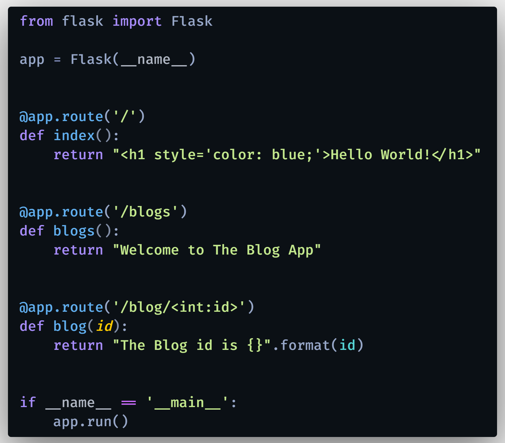
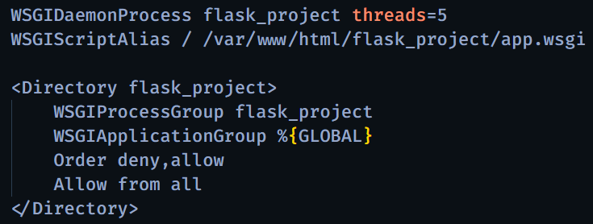

# Python: Inserción masiva de datos (en MySQL) con Python

Aprende a realizar inserciones masivas en una base de datos MySQL usando un script de Python, de una forma fácil, ordenada y funcional. Cónoce cómo generar datos de prueba, aleatorios y estructurados para registrarlos de forma masiva en una tabla perteneciente a una base de datos MySQL.

Actualizar los paquetes de Ubuntu:

#### `sudo apt update`
#### `sudo apt upgrade`

Instalar Apache2 (si no está instalado) y el paquete 'libapache2-mod-wsgi-py3':

#### `sudo apt install apache2`
#### `sudo apt install libapache2-mod-wsgi-py3`

Comprobar la versión de Python instalada:

#### `python3 --version`

Instalar Python (si no está instalado) y PIP (Package Installer for Python):

#### `sudo apt install python3`
#### `sudo apt install python3-pip`

Listar los paquetes instalados:

#### `pip3 list`

Instalar Flask de forma global:

#### `sudo pip3 install flask`

Crear carpeta (dentro de nuestro VPS) para los archivos de nuestro proyecto:

#### `cd /var/www/html`
#### `sudo mkdir flask_project`

Acceder a la carpeta 'sites-enabled' (de Apache) y eliminar el archivo '000-default.conf':

#### `cd /etc/apache2/sites-enabled`
#### `sudo rm 000-default.conf`

Copiar los archivos 'app.py' y 'app.wsgi' hacia la carpeta 'flask_project' creada dentro de nuestro VPS:

#### `pscp <directorio_de_tu_pc>\app.py root@<ip_vps>:/var/www/html/flask_project`

#### `pscp <directorio_de_tu_pc>\app.wsgi root@<ip_vps>:/var/www/html/flask_project`

Copiar el archivo '000-default.conf' a la carpeta 'etc/apache2/sites-enabled':

#### `pscp <directorio_de_tu_pc>\000-default.conf root@<ip_vps>:/etc/apache2/sites-enabled`

Reiniciar el servicio de Apache2:

#### `sudo service apache2 restart`

  

  

# 🌍 Por si deseas contactarme 👨‍💻 :

